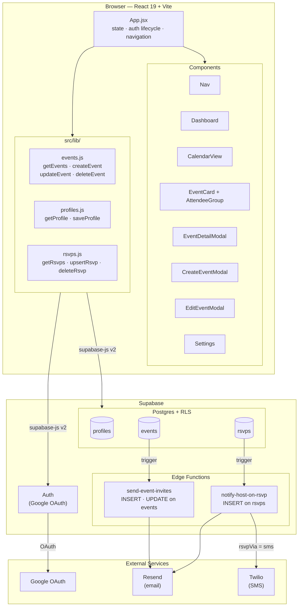

# Gather — Architecture Diagram

## Layer summary

| Layer | Technology | Responsibility |
|---|---|---|
| Browser | React 19 + Vite | UI, state, navigation |
| Auth | Supabase Auth + Google OAuth | Session management, JWT |
| Database | Supabase Postgres + RLS | Data storage, access control |
| Edge Functions | Supabase (Deno) | Email invites, host notifications |
| Email | Resend | Transactional email delivery |
| SMS | Twilio | Optional SMS notifications |

## Data flow — key paths

**User creates an event**
1. `CreateEventModal` → `App.handleCreateEvent` → `lib/events.createEvent`
2. Supabase inserts row into `events` (RLS: `host_id = auth.uid()`)
3. `send-event-invites` edge function fires → Resend emails all invitees

**User RSVPs**
1. `EventCard` / `EventDetailModal` → `App.handleRsvp` → `lib/rsvps.upsertRsvp` (optimistic update)
2. Supabase upserts row into `rsvps` (RLS: user must be host or invited attendee)
3. `notify-host-on-rsvp` edge function fires → Resend or Twilio notifies host based on `profiles.notifications.rsvpVia`

**Auth**
1. `Nav` sign-in → Supabase Google OAuth → session stored in browser
2. `App.jsx` listens to `onAuthStateChange` → fetches profile + events + RSVPs on session start
